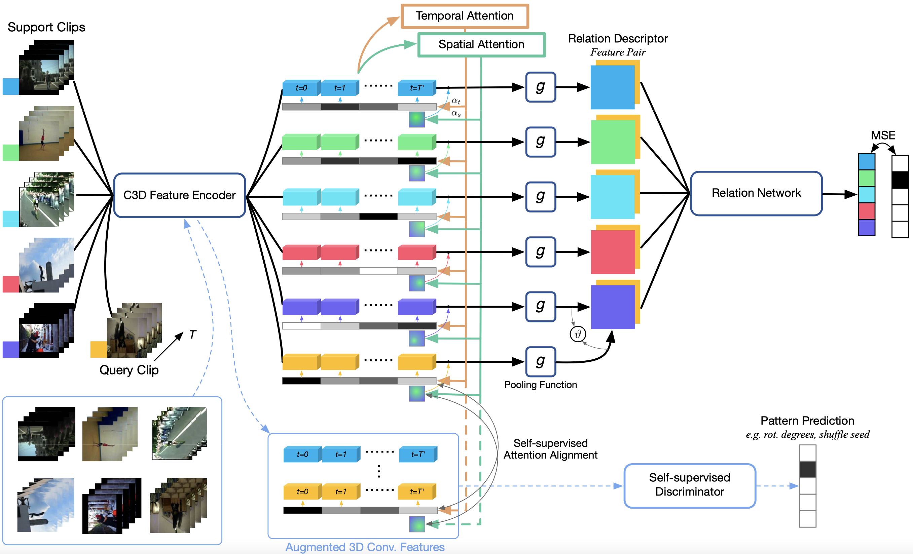

# arn-eccv20-master
The code for ECCV'20 paper 'Few-shot Action Recognition via Permutation-invariant Attention' (http://www.ecva.net/papers/eccv_2020/papers_ECCV/papers/123500511.pdf)"<br/>



__Requires.__
```
pytorch-1.7.1
numpy
scipy
```


__For miniImagenet training and testing, run following commands.__

```
python eval_arn.py -s $SHOT -d 'hmdb51' -m 'saa_jigsaw'
-s: shot number
-d: dataset
-m: model name
```

## Citation
If you use this code in your research, please cite the following paper.

```
@inproceedings{zhang2020few,
  title={Few-shot action recognition with permutation-invariant attention},
  author={Zhang, H and Zhang, L and Qi, X and Li, H and Torr, PHS and Koniusz, P},
  booktitle={Proceedings of the European Conference on Computer Vision (ECCV 2020)},
  volume={12350},
  year={2020},
  organization={Springer}
}
```
